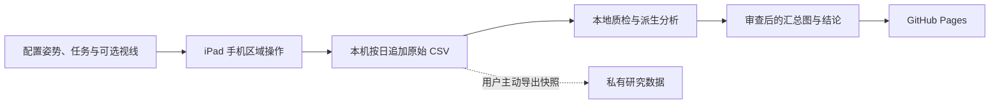

# Intentional Hover Study｜产品需求文档

- **版本：** 1.0 · 2026-09-16
- **产品形态：** 原生 iPad 研究采集 App ＋ GitHub Pages 分析报告
- **现状基线：** App V2.3／可选视线采集 V2.4；Pages 综合报告已上线
- **性质：** 基于当前实现的活文档。文中“已实现”指代码或页面存在；“已验证”仅指列出的实际检查。

## 1. 一句话定义与目的

本项目用绑指 Apple Pencil 在 iPad 的固定手机区域模拟手机操作，采集**触屏前、悬停中和触屏后**的连续行为，再用可追溯的分析报告研究：人有意指向或选择目标时，是否存在区别于自然阅读、直接点击和滚动准备的运动序列。

长期目标是为未来的手机裸指 Hover 交互找到可检验的意图线索，减少悬停菜单或选择的误触发。当前原型的直接产物是**高质量、带任务语境的原始数据和诚实标注限制的分析证据**，不是可上线的意图识别器。Pencil 是传感代理；它的轨迹、Z 原值和阈值不能直接等同于裸指或真实高度。

### 核心研究问题

1. 有目标的 Hover 是否呈现“移向目标 → 减速或高度变化 → 确认 → 移向下一个目标”的可重复序列？B1 菜单、B2 单选、B3 多选、B4 圈选分别检查不同形态。
2. 自然阅读时 Pencil 的 **Home position** 在哪里、要观察多久才能形成稳定的位置参考？Home 是空间分布，不由 500／800 ms 停留时长定义。
3. 如果把菜单或选择停留阈值从 100 ms 调到 1000 ms，自然阅读中“规则可能触发”的候选会如何变化？候选不是真实误触标签；只有按新阈值重新采主动任务，才能估计召回与准确率。
4. 前摄估计视线能否为运动线索增加证据？只有在独立校准、小目标正对照和主动／自然同场景验证通过后，才评估眼手同对象；缺失或低质量视线必须拒判。

## 2. 用户、使用场景与产品边界

| 用户 | 要完成的事 | 对应产品 |
|---|---|---|
| 参与者 | 看清当前任务与剩余次数，在手机大小的区域自然完成操作 | 采集 App |
| 研究者 | 选择姿势和任务、完成一组采集、保存并导出可追溯 CSV | 采集 App |
| 分析者 | 排除手指污染与手机外点，比较任务、姿势、场景和动作阶段 | 本地分析工具与 Pages 回放 |
| 研究读者 | 理解研究目的、证据来源、主要发现和局限，复现公开汇总检查 | GitHub Pages 与源码仓库 |

研究设备为 12.9 英寸第六代 iPad Pro、第二代 Apple Pencil。姿势可选单手拇指或托握＋食指，Pencil 绑在相应手指旁。正式采集使用横屏固定 `1366 × 1024 pt` 画布，右下角手机交互区为 `(976, 194, 390, 830)`；数据分析只把手机局部 `0–390 × 0–830 pt` 的有效 Pencil 点用于手机轨迹。实验任务可按需选择，不要求每位参与者完成全部 14 类。

**数据边界：** Pages 默认没有原始采集；浏览器回放工具初始为空，用户自行导入的 CSV 在浏览器内处理。仓库只同步源码、协议、分析方法、公开汇总和经过审查的派生图，不上传正式 CSV、逐点眼动、设备备份、面部画面或个人签名。

## 3. 第一部分：采集 App

### 3.1 主要流程与界面要求

1. 启动后在后台完整检查既有 CSV 和未结束会话；检查完成前不能开始新采集，不能靠清空旧数据缩短等待。
2. 首页持续显示 A1–C3 全部任务。研究者选择参与者、姿势、任务及参数，按“开始实验”；开启可选视线时先做校准和独立验证。
3. 手机区上方固定显示**当前实验／任务、可执行中文指令、第几次与本组总数、后续剩余次数、当前阶段或保存状态**。阅读段显示段数；“后续剩余”不计正在进行的一次。手机内容区域不被实验说明遮挡。
4. 顶部任务操作为“开始实验”“重做当前次”“导出 CSV”“结束实验”。结束实验写入会话结束并清除恢复检查点，保留历史 CSV；导出是已刷新文件的快照，原文件继续追加。
5. A／C 未成功时保留该尝试并以新 trialID 重做原计划题，几何、条件、序号和剩余数不变。B 记录每次成败后推进，以观察成功率和轨迹。后台中断或写盘失败必须提示可执行的恢复动作，不能静默丢样本或跳题。

### 3.2 任务矩阵与默认量

| 组 | 任务 | 参与者实际操作 | 默认计划量 |
|---|---|---|---:|
| A1 | 抽象目标点击 | 点击圆形目标并抬笔 | 18 次 |
| A2 | 抽象目标拖动 | 把方块拖入目标区域并释放 | 18 次 |
| A3 / A4 | 纵向／横向滚动 | 移动抽象条带，使标记进入终点窗口并抬笔 | 各 6 次 |
| A5 / A6 / A7 | 新闻长文／图文流／短视频流 | 自然阅读或浏览，无答题 | 各 1 段 × 120 秒 |
| B1 | 悬停菜单后点击 | 目标内悬停 500 ms 唤菜单，再点击指定项 | 12 次 |
| B2 | 悬停单选 | 目标内连续悬停 500 ms 自动选中，不触屏 | 12 次 |
| B3 | 悬停多选 | 分别悬停选中三个指定目标，不触屏 | 12 次 |
| B4 | 空中圈选 | 悬停轨迹圈住指定目标并回起点闭合，不触屏 | 12 次 |
| C1 | 点击 vs Hover | 同一抽象目标：直接点击或悬停选择 | 12 次 |
| C2 | 滚动 vs Hover | 同一抽象条带：滚动或悬停选择小标记 | 12 次 |
| C3 | 阅读停留 vs Hover | 同一内容对象：自然阅读或悬停选择 | 36 次 |

全部选中时是 **156 次短任务＋3 段自然阅读**。默认配平与随机顺序写入配置；C 两条件共享对象几何并随机混合。A1/A2 使用多距离、多尺寸抽象目标。C3 的 48 × 48 pt 指向许可配图中固定的蝴蝶内容对象，三种场景共享对象语义；收藏／点赞星标不是目标。新闻、图文和短视频均可实际操作，视频有真实离线素材。

### 3.3 采集、视线与恢复要求

- UIKit 采集真实 Pencil 悬停、接触与手指污染，SwiftUI 显示任务；原始坐标、手机局部坐标、API `zOffset`、时间来源、序号、输入来源及事件分别保存。Z 不换算为毫米；接触期间无 Z 就留空。
- 连续采样按原来源和单调时间保留。触屏、悬停结束、移出手机、污染或超过 100 ms 回调缺口在分析中断线；不得平滑、补点或把算法闭合边冒充圈选实测点。
- B1–B3 的 500 ms 规则按同一对象的连续有效悬停判定；B4 按实测 XY 圈线几何提交。自然阅读只静默记录“规则可能触发”候选，不弹菜单或改变阅读行为。
- 可选前摄视线默认关闭。开启后使用手机区 9 点拟合、4 点独立验证；视线样本与质量、时间来源写入同一 CSV，但**不参与当前任务成败判定**。低质量、失跟踪或相机不可用均标记为不可用；不把缺失当作“没有看目标”。默认不保存相机画面。
- 正式 CSV 按日期持续追加，最长 250 ms 刷新缓冲；试次结束、后台与导出前强制刷新。保留失败、重做、跳过与中断记录；恢复时保护完整旧行及残缺尾行证据。模拟数据单独目录并明确标记。
- 当前 56 列 CSV 兼容旧 Test 0–4 和 V2.1–V2.4；V2.4 仅在选择视线采集时启用。新旧会话按 `protocolVersion` 分析，不改写历史记录。

### 3.4 App 验收标准

- 14 类任务及可选姿势／任务正确生成，完成方式、条件、指令、共享几何和计数一致；A／C 重试不重复累计计划进度，B 成败都留痕。
- 首页任务清单持续可见，手机上方提示在开始、暂停、失败、重做、恢复、结束和视线校准时均可理解。
- 真实 Pencil 悬停→接触→移动→抬笔、B1 菜单、B2/B3 零触屏选择、B4 零触屏圈选及三种阅读场景逐类在目标 iPad 检查。
- CSV 可由 pandas 读取；接收、落盘和导出快照能对账；完整性检查、跨日追加、后台恢复和写盘失败恢复不丢旧数据。
- 视线先报告独立验证误差、有效覆盖与漂移。小对象探索门槛为 P90 ≤24 pt、有效帧 ≥70%；未达门槛时仅做粗区域探索，不输出小对象意图判定。

## 4. 第二部分：GitHub Pages 分析报告

### 4.1 已发布的信息架构

| 页面 | 当前职责 |
|---|---|
| [研究首页](https://purryc.github.io/Intentional-Hover-Study/) | 说明研究范围、14 类任务、核心发现，进入报告、安装与回放 |
| [综合报告](https://purryc.github.io/Intentional-Hover-Study/report/combined.html) | 串联有目标动作、阅读 Home、V2.4 视线正对照；四张审查后派生图 |
| [V2.1 完整报告](https://purryc.github.io/Intentional-Hover-Study/report/study-report.html) | 保留 12 章、17 图及来源、质量、任务与 C 回顾性检查 |
| [3D 回放](https://purryc.github.io/Intentional-Hover-Study/replay/replay-v2.html) | 用户本地导入 CSV 后，按任务、姿势、场景和条件查看手机内 Pencil 轨迹与事件 |
| [安装与数据说明](https://purryc.github.io/Intentional-Hover-Study/install.html) | 源码安装、当前任务逻辑、模拟与正式数据边界 |

Pages 是**已审查的研究快照**，不是直接查询用户 iPad 的实时仪表盘。完整两日交互分析、Home 定位和 100–1000 ms 阈值滑杆目前主要在本地 `analysis/`，公开综合页尚未提供这些交互控件；是否纳入 Pages 应以隐私审查、来源锁定与页面可读性为前提。当前浏览器回放提供的是导入自己的数据进行探索，公开站点不预载正式逐点数据。

### 4.2 报告与图表要求

1. 每个结论都给出**采集日期、协议版本、姿势、任务条件、样本或事件分母、来源哈希和限制**；跨版本只作明确可比的描述，不把协议／练习／目标大小变化归因于模型进步。
2. 主视图优先展示完整阶段：Touch 的接近与落笔、阅读 Home 的位置、B1 菜单、B2 单选、B3 多选的到达／确认／迁移；不同确认事件各自标明 0 点，不能合并成同一种心理动作。B4 独立展示圈线、闭合误差和选中集合。
3. XY 速度、加速度只从连续手机内 Pencil 实测点及真实时间差计算；Z 展示 API 原值变化率 `|ΔZ|/Δt` 与有符号变化率，使用独立轴，不标毫米每秒。缺口留白，图旁公开有效覆盖和事件数；密集明细放可展开证据区。
4. 阅读 Home 使用时间加权空间热区，按场景、姿势和观察前缀估计定位时间与后半段复现；与同对象停留阈值分析分开。阈值回算以完整 `DWELL_END` 段为单位，一段最多计一次候选，输出每记录分钟候选率而非“真实误触率”。
5. 眼动分析先通过有目标操作作正对照，再谈自然阅读。任何眼手同对象图都显示校准质量和视线覆盖；低质量、无视线或无 B/C 对照时拒绝报告识别准确率。
6. 公共页面与仓库保留分析脚本和审查后的派生结果；正式 CSV、逐点眼动、完整逐点回放、设备信息、面部画面和签名留在本地。回放工具导入 CSV 不向服务器上传。

### 4.3 当前证据与解释限制

- V2.1 旧报告来自**一位参与者**的右手拇指与右手食指两轮；C 数据曾被探索，现有留组结果是回顾性的。
- V2.3 两轮运动汇总与 V2.1 的目标和推进规则不同，综合页分别标注。B2/B3 的减速与下沉线索值得继续看完整序列，但 500 ms 驻留本身是任务要求，不能据此称已识别心理意图。
- 最新 V2.4 视线会话只覆盖 A1–A7：三段约两分钟阅读和 18 次成功 A1 点击。校准质量为 `COARSE_ONLY`，留出点 P90 为 211.9 pt；16 次有有效点击前视线的 A1 中，14 次视线未进入目标中心 50 pt 范围。当前前摄结果不能作为 48 pt 对象意图过滤器，也没有 B/C 含视线的召回或准确率。

### 4.4 Pages 验收标准

- 从首页能到综合报告、旧版完整报告、回放、安装和数据说明；来源与版本清楚，图像与链接可在线打开。
- 公开构建检查文件清单、链接、媒体归属、来源哈希和敏感数据；Pages 只部署 `site/`，回放默认空数据。
- 若后续上线阈值滑杆或完整运动图谱，控件改变时同步更新分母、条件和候选定义；任何没有实际主动试次支持的阈值，不输出准确率、召回或精确率。
- 新数据上线前先锁定分析输入、执行本地质检与视觉审阅，再生成站点快照；旧版本报告可回看。

## 5. 衡量方式、状态与下一步

| 维度 | 应报告的指标 | 目前状态 |
|---|---|---|
| 采集完整性 | 计划题、实际尝试、失败／重做、接收与落盘数、缺口和导出一致性 | 核心／UI 自动测试与现有 CSV 格式检查通过；新版逐类 Pencil 与 15 分钟专项待做 |
| 行为对照 | A 自然基线、B 主动操作的事件数、成功率、有效连续段和阶段曲线 | 旧会话已探索；样本为单人、跨版本，尚不足以给出总体分类性能 |
| 混淆验证 | 同场景 C 条件的候选率、主动召回、漏选、拒判 | 旧 C 为回顾性检验；需要冻结特征后做新的独立参与者验证 |
| 视线质量 | 独立校准 P50/P90、有效覆盖、阅读后漂移、A1 正对照命中 | 新会话 P90 211.9 pt，未达到小对象门槛；B/C 视线对照尚无 |
| 公开交付 | Pages 构建、链接、来源哈希、隐私清单 | 已发布综合页和旧报告；公开文件检查通过 |

**下一轮优先级：**

1. 在目标 iPad 按当前版本逐类完成 A/B/C，做至少 15 分钟接收与落盘对账和实际导出；记录真实故障及恢复。
2. 同一姿势重复前摄校准并在阅读后复测；先确保 A1 已知目标正对照可用，再评估 B2/B3/C3。若精度仍不够，转向更大内容区域或专用眼动设备。
3. 冻结运动特征、时间窗、Home 与停留阈值，增加新参与者／新会话验证。将“规则可能触发”与经观察标注的真实误触分开收集。
4. 决定哪些本地交互分析适合公开。优先公开清楚的分母、覆盖和限制，再考虑阈值滑杆与更完整的 3D 图谱。

## 6. 非目标、风险与决策约束

- 本阶段不把前摄视线或运动规则接入在线自动选中；不声称能检测用户真实心理意图，也不把视觉注意等同于授权。
- 不推断 Pencil Z 为毫米、裸指高度或物理三维速度；绑指 Pencil、握姿、学习效应和右下角手机仿真几何都可能影响外推。
- 不公开原始人类行为数据或脸部影像；公开汇总须符合[数据可用性说明](../site/data-availability.html)与[媒体来源](media-sources.md)。
- 旧 Test 0–4 及旧 CSV 保留兼容，但本 PRD 的主要研究矩阵是 A1–C3；第二阶段语义指代、输入／手写和阅读理解题不在当前范围。

## 7. 源码与验收依据

- [任务与推进协议](protocol-v2.md) · [视线补充协议](protocol-gaze-v2-4.md) · [数据字典](data-dictionary-v2.md)
- [App 源码](../src/) · [公开站点源码](../site/) · [发布与复现](publishing.md)
- [当前公开验收记录](../qa/verification-v2-4-public.md) · [旧版完整报告](../site/report/study-report.html) · [综合报告](../site/report/combined.html)

本 PRD 记录目的、使用者与验收边界；具体实验参数以协议文档及 CSV 中每个会话实际保存的配置为准。修改任务成功规则、采样字段或公开分析口径时，应同时更新相应协议／数据字典、测试与版本说明。
