> 公开版保留12章、17张分析图与汇总参数；原始CSV、逐点指标及完整轨迹只保存在本地。3D工具需自行导入CSV。

# Hover Intent Study：行动轨迹与意图特征统一报告

**本轮最清楚的区别是动作阶段和路径结构：B1 两阶段菜单操作、B3 多对象“移动→驻留→再移动”、B4 大面积闭合空中路径。减速、低速或500ms停留单独区分 intentional hover 的能力有限。**

- 两轮都是右手：第一轮绑拇指，第二轮托握＋食指；仅一位参与者，先后顺序与练习效应未分离。
- 静态两特征模型在 C3 回顾性留组检验中识别23/27主动窗，却把20/69自然候选误报为主动；平衡准确率78.1%，目前不能作为可靠自动唤出规则。
- B4 原协议成功7/12；独立几何扫描在8/12次圈选尝试发现闭合候选，A基线103次尝试中为0，但B1和C3自然各有1次，圈形并不等于意图。
- 6个姿势×场景位置模型只有3个热点在后半段复现。固定50pt home过滤没有减少C3自然误报，并误排1个主动窗；应保留为位置参考，当前不部署硬过滤。
- 新采集协议 V2.2 已修改目标范围和重试流程；下文实测结论全部来自旧 V2.1，不把新版实现当成新增实验结果。

本报告汇总此前两轮比较、静态意图区分、运动阶段、多选、A/B→C检验与home位置分析；完整原CSV、失败尝试及原菜单判定保留。图点击可查看原始分辨率。

## 1. 参与者、采集概况与完整任务结果

| 姿势 | 本地时间 | 会话分钟 | 短任务动作完成（覆核后） | 阅读成功／尝试 | 接收样本 |
| --- | --- | --- | --- | --- | --- |
| 拇指 | 18:03:29–18:21:38 | 18.15 | 109/132（82.6%） | 3/3 | 73,836 |
| 食指 | 18:27:01–18:44:16 | 17.26 | 106/132（80.3%） | 3/4 | 77,069 |

第二轮 A7 有一次 `REDO_REQUESTED` 的未完成尝试，另一次完成；该部分单独保留，完整阅读比较仅取完成的 120 秒段。两轮均尝试全部 14 类任务，没有模拟来源或手指输入。

### 14类任务结果

| 任务／条件 | 拇指成功 | 食指成功 | 拇指目标→成功秒 | 食指目标→成功秒 |
| --- | --- | --- | --- | --- |
| A1 点击 / TOUCH | 17/18 | 16/18 | 0.94 | 1.03 |
| A2 拖动 / TOUCH | 18/18 | 14/18 | 1.21 | 1.26 |
| A3 垂直滚动 / TOUCH | 6/6 | 6/6 | 0.91 | 1.19 |
| A4 水平滚动 / TOUCH | 6/6 | 6/6 | 0.83 | 1.11 |
| A5 长文阅读 / NATURAL | 1/1 | 1/1 | 120.03 | 120.00 |
| A6 图文浏览 / NATURAL | 1/1 | 1/1 | 120.00 | 120.03 |
| A7 视频浏览 / NATURAL | 1/1 | 1/2 | 120.03 | 120.03 |
| B1 悬停菜单 / HOVER | 6/6 | 6/6 | 2.90 | 3.04 |
| B2 悬停单选 / HOVER | 6/6 | 6/6 | 1.24 | 1.20 |
| B3 悬停多选 / HOVER | 6/6 | 6/6 | 4.22 | 3.56 |
| B4 空中圈选 / HOVER | 2/6 | 5/6 | 3.21 | 2.89 |
| C1 点击 vs Hover / HOVER | 0/6 | 0/6 | — | — |
| C1 点击 vs Hover / TAP | 6/6 | 6/6 | 1.10 | 0.94 |
| C2 滚动 vs Hover / HOVER | 2/6 | 2/6 | 0.52 | 0.52 |
| C2 滚动 vs Hover / SCROLL | 3/6 | 1/6 | 1.32 | 1.64 |
| C3 阅读 vs Hover / HOVER | 13/18 | 14/18 | 2.30 | 1.75 |
| C3 阅读 vs Hover / NATURAL | 18/18 | 18/18 | 20.03 | 20.00 |

时间只比较成功试次，不把快速失败当作更快完成；目标出现前的起点准备不包含在该时间中。C3 自然条件约 20 秒，A5–A7 约 120 秒。

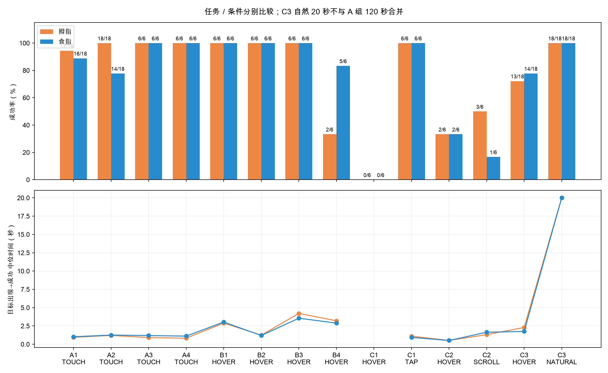

### 同几何姿势配对

| 任务 | 两轮都成功配对数 | 拇指秒 | 食指秒 | 食指−拇指配对差秒 |
| --- | --- | --- | --- | --- |
| A1 | 15 | 0.90 | 1.05 | 0.10 |
| A2 | 14 | 1.21 | 1.26 | 0.00 |
| B1 | 6 | 2.90 | 3.04 | -0.01 |
| B2 | 6 | 1.24 | 1.20 | -0.04 |
| C1 | 6 | 1.10 | 0.94 | -0.20 |

按距离、直径、方向和条件配对；只用双方成功记录。这是描述性对比，样本来自同一人，不能把先后顺序／熟悉程度的影响排除。配对原始 ID 见 [paired_metrics.csv](../data-availability.html#local-files)。

### 用户覆核

两轮均右手。B1 原协议各 3/6，动作覆核后各 6/6；短任务原成功分别 106/132、103/132，覆核后 109/132、106/132。覆核只应用于菜单已出现、实际选 B、原错误仅 WRONG_MENU_ITEM 的六条记录。原始 taskInstruction、rawSuccess/rawError 和 CSV 均保留，详见 [analysis-annotations.json](../data-availability.html#local-files)。更正前的小型报告／指标保存在 revisions/pre-clarification/。

## 2. A1–A7 手机 baseline 与阅读场景

| 任务 | 完成／尝试 | 成功试次有接触数 | 目标后悬停速度中位 pt/s | 接触速度中位 pt/s |
| --- | --- | --- | --- | --- |
| A1 点击 | 33/36 | 33 | 88.4 | 66.2 |
| A2 拖动 | 32/36 | 32 | 61.5 | 182.0 |
| A3 纵向滚动 | 12/12 | 12 | 66.4 | 383.2 |
| A4 横向滚动 | 12/12 | 12 | 38.8 | 229.9 |
| A5 长文阅读 | 2/2 | 2 | 51.2 | 83.3 |
| A6 图文浏览 | 2/2 | 2 | 56.3 | 63.2 |
| A7 短视频浏览 | 2/3 | 2 | 108.4 | 136.8 |

A1 是目标接近后落笔；A2 是接触中的起步、拖动与制动；A3/A4 是定向接触移动；这些也会出现加速峰和减速。因此“有减速”不是 Hover 独有特征。A5–A7 是悬停、接触、滚动、内容导航交替；自然同对象达标候选不要求笔尖静止。短视频对象范围大，笔尖移动较远仍可留在同一对象内。

速度每试次先作同段时间加权，再取成功试次中位数，且仅取目标出现后。自然阅读长达 120 秒，不能把其总路径、最大速度或线密度与几秒钟短任务直接比较。第二轮 A7 的未完成重做另计尝试，完整阅读对比取完成段。

### 120秒自然阅读与场景操作

| 120 秒场景 | 姿势 | 候选次数 | 候选／分钟 | 有效连续悬停秒 | 达标停留中位秒 | 页面操作 |
| --- | --- | --- | --- | --- | --- | --- |
| 长文阅读 | 拇指 | 14 | 7.00 | 34.2 | 1.15 | 打开 0 / 翻图 0 / 视频切换 0 |
| 长文阅读 | 食指 | 12 | 6.00 | 37.9 | 1.23 | 打开 0 / 翻图 0 / 视频切换 0 |
| 图文浏览 | 拇指 | 13 | 6.50 | 45.8 | 0.91 | 打开 5 / 翻图 12 / 视频切换 0 |
| 图文浏览 | 食指 | 11 | 5.50 | 64.2 | 0.88 | 打开 4 / 翻图 6 / 视频切换 0 |
| 视频浏览 | 拇指 | 31 | 15.50 | 68.0 | 1.15 | 打开 0 / 翻图 0 / 视频切换 21 |
| 视频浏览 | 食指 | 37 | 18.49 | 53.0 | 0.69 | 打开 0 / 翻图 0 / 视频切换 41 |

候选表示同一内容对象内达到了 500 ms 规则，长停留只计一次，不等于实际误触。有效悬停秒是合法连续实测边时长之和，非完整 120 秒的传感覆盖。屏幕轨迹集中也可能是握持习惯或内容位置，滚动后的同一屏幕位置并非同一内容对象。

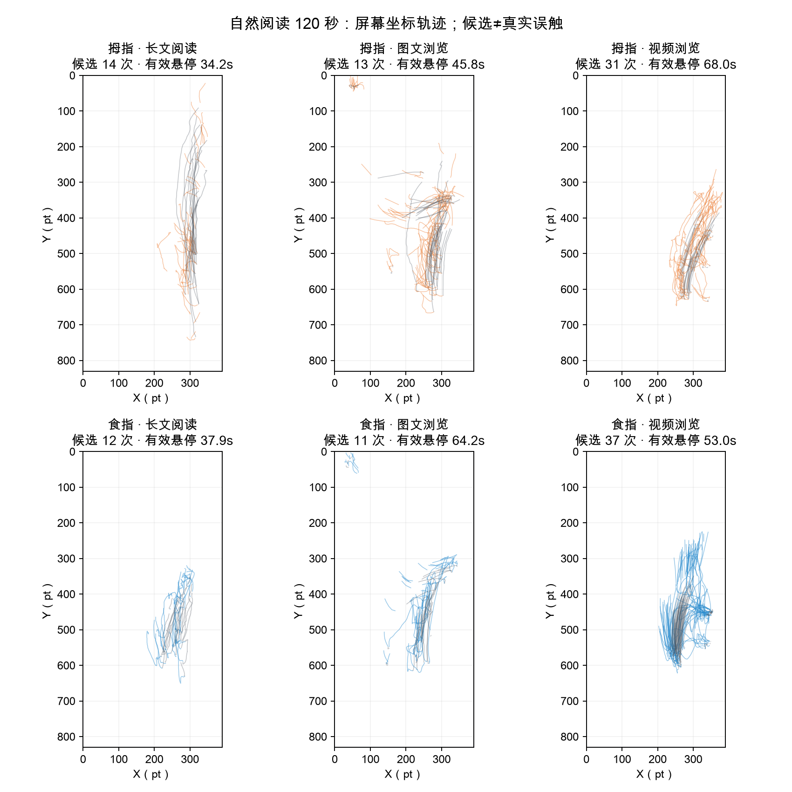

### 本轮场景与姿势变化

1. **食指的空中圈选更容易完成，但仍有练习效应。** 拇指 2/6、食指 5/6；中断 8→1 次。拇指前四次圈选失败、后两次成功，说明熟悉任务的过程已经发生，不能把全部改善归为姿势。
2. **抽象滚动中，拇指操作节奏更快。** 垂直／水平滚动两轮都 6/6；目标出现至完成中位数分别为拇指 0.91/0.83 秒、食指 1.19/1.11 秒。食指成功拖动的连续路径略直，但四次拖动失败是三次起点尚未准备就触屏、一次源方块外起拖，不能解释为拖动途中失控。
3. **短视频最容易达到静默 500 ms 规则。** 两分钟内拇指／食指候选为 31/37 次，长文为 14/12 次、图文为 13/11 次。视频候选几乎全部来自大面积视频对象；食指同时切换视频更频繁（41 vs 21 次），停留段更短，可能产生更多新的候选机会。这不是已发生 31/37 次误触。
4. **阅读轨迹有固定操作带。** 两姿势都主要在手机右侧活动；长文中食指轨迹更集中于中下部，拇指纵向覆盖更广。长文滚动最大偏移分别约 4,800/2,717 pt，内容浏览进度不同，会影响停留和轨迹，需结合场景状态回放。
5. **B1 菜单动作两轮均完成 6/6。** 用户说明将所有指定项理解为 B；六条原 WRONG_MENU_ITEM 记录按动作完成覆核，原指令与失败判定保留。C1 的 HOVER 两轮均 0/6，仍全部因 Pencil 触屏；此次菜单覆核不改动其他错误。

## 3. B1/B2：Hover pointing、菜单后点击

| 主动行为 | 本轮可见结构 | 最相关 A 基线 | 区别强弱与限制 |
| --- | --- | --- | --- |
| B2 Hover pointing／单选 | 接近目标→目标内停留→零触屏选择 | A1 同几何点击；A5/A6 阅读停留 | 完成结构不同；低速与制动同样出现在点击和阅读中，500 ms 是协议设定 |
| B1 Hover 后点击 | 目标内停留→菜单保持打开→移向菜单项并点击 | A1 同几何点击 | 两阶段动作清楚；菜单出现后的证据只能验证已完成动作，不能回推出现前的心理意图 |
| B3 Hover multiselect | 目标 1 驻留→转移→目标 2 驻留→转移→目标 3 驻留，全程无接触 | A5/A6 内容停留／对象切换 | 顺序空间转移比单次低速更有辨识度；本轮无同布局的自然多点操作基线 |
| B4 空中圈选 | 连续移动→较大面积闭合路径→提交对象集合 | A 自然悬停与接触操作 | 本轮路径结构最独特；需独立滑窗查基线是否也有闭合轮廓，且缺少同布局非圈选条件 |

本轮 B2 是纯悬停指向／单选，不是旧协议 Test 1 的指向后点击。B3/B4 的指定对象和完成要求由任务决定，不能把任务要求本身称为新发现的心理意图特征。

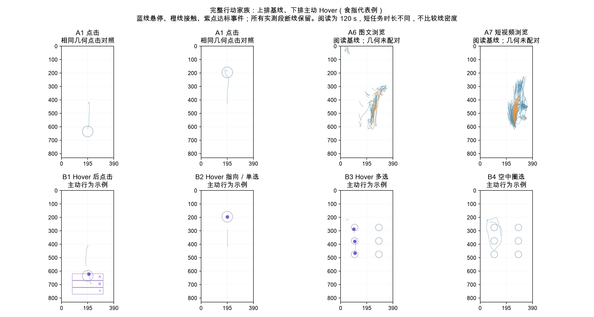

### 匹配几何与目标停留

| 距离 220 pt、同姿势／尺寸／方向配对 | 共同成功试次数 | 触屏／菜单／选择前目标内最长连续悬停中位 ms | 没有观测到目标内悬停 |
| --- | --- | --- | --- |
| A1 | 10 | 208.1 | 0 |
| B1 | 10 | 500.7 | 0 |
| B2 | 10 | 500.3 | 0 |

仅比较三任务均成功的 10 套相同几何，未成功 A1 不补造匹配。全部 33 个成功 A1 中也有 1 次点击前目标内连续悬停约 1,331 ms：超过 500 ms 并不等于在执行主动 Hover 选择。

只计圆形目标内、目标呈现后的实测连续悬停；A1 在首个接触处截止，B1 在菜单出现处截止，B2 在悬停选择处截止。零命中并不证明没有对准，可能是接近末段超出悬停感应或直接落笔。B1/B2 的长驻留由 500 ms 规则强制，不能当作自由行为分离验证。

## 4. B3：Hover multiselect 的完整过程

两姿势均 6/6 完成，共 36 次悬停选择。每次选择有连续约 500 ms 停留；选择后再移向下一个对象。圈内 1/2/3 标出实际顺序，灰色保留早退、重定位和重试。

| 姿势 | 成功／试次 | 选择数 | 连续可比窗口 | 进入前速度中位 pt/s | 停留速度中位 pt/s | 同次停留／接近速度比中位 | 停留更慢次数 |
| --- | --- | --- | --- | --- | --- | --- | --- |
| 拇指 | 6/6 | 18 | 1 | 268.8 | 31.4 | 0.12 | 1 |
| 食指 | 6/6 | 18 | 11 | 218.1 | 58.1 | 0.28 | 11 |

进入前取 300 ms、覆盖至少 200 ms；停留取前 500 ms、覆盖至少 450 ms，且必须处于同一连续悬停段。“连续可比”之外的选择仍展示，但不计算速度下降。速度比 0.5 表示该次停留速度为进入前的一半；统计描述笔尖运动，不推断心理意图。

**食指的减速结构比较清楚：11 个连续可比的选择全部在进入目标后降速。** 接近速度中位约 218 pt/s，停留约 58 pt/s，同次速度比中位约 0.28，即下降约 72%。拇指只有 1 个选择有足够连续接近数据，其余 17 个缺少所需前窗，不能据此比较两姿势的制动能力，也不能把追踪断开解释为减速。

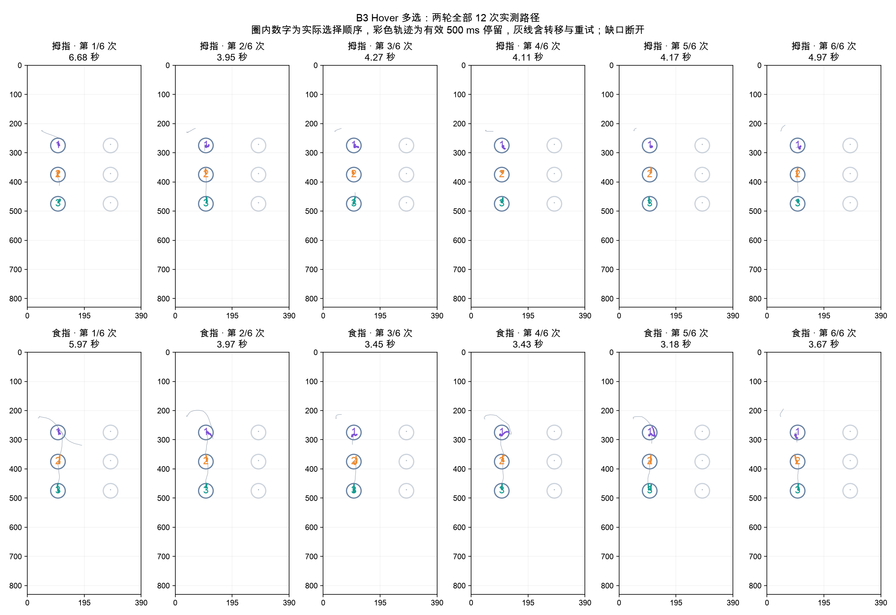

## 5. B4：空中圈选的成功、轨迹与闭合候选

| 姿势 | 成功 | 有效闭合 | 中断 | 闭合耗时秒 | 实测路径 pt | 闭合误差 pt | 中断原因 |
| --- | --- | --- | --- | --- | --- | --- | --- |
| 拇指 | 2/6 | 2 | 8 | 1.42 | 587.0 | 17.3 | {"OUTSIDE": 4, "TIMEOUT": 1, "UNEXPECTED_TOUCH": 3} |
| 食指 | 5/6 | 5 | 1 | 1.18 | 756.0 | 19.6 | {"UNEXPECTED_TOUCH": 1} |

圈选耗时从开始画线到闭合，排除起点准备；路径不含算法闭合边。没有闭合的失败无法比较完整圈选面积或耗时，已保留中断轨迹。

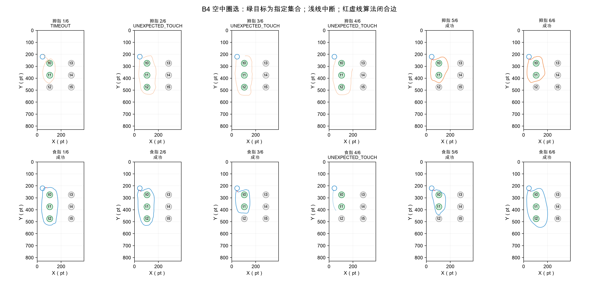

### 全任务独立闭合扫描

| 任务 | 保留尝试数 | 含独立闭合候选的尝试数 | 目标后可观测连续悬停秒 |
| --- | --- | --- | --- |
| A1 | 36 | 0 | 25.4 |
| A2 | 36 | 0 | 17.9 |
| A3 | 12 | 0 | 5.9 |
| A4 | 12 | 0 | 4.7 |
| A5 | 2 | 0 | 72.1 |
| A6 | 2 | 0 | 110.1 |
| A7 | 3 | 0 | 121.1 |
| B1 | 12 | 1 | 32.7 |
| B2 | 12 | 0 | 14.3 |
| B3 | 12 | 0 | 37.4 |
| B4 | 12 | 8 | 45.0 |

扫描不读取 LASSO_CLOSE 或任务名作为识别依据。每 100 ms 选一个实测起点，扫描 0.5–3 秒连续悬停窗，要求回到 20 pt 内、离起点至少 40 pt、路径至少 120 pt、至少 12 点、面积至少 2,000 pt²。只允许末点到首点的算法闭合边，不跨缺口。自然长段有更多候选机会，表中同时报告实际可观测悬停秒。候选表示闭合轮廓，不表示成功选对对象或真实圈选意图；扫描会漏掉起点错位、时间窗外或追踪中断的圈线。

A1–A7 的 103 个保留尝试均未发现该闭合候选。B4 候选 8 次包含 6 个成功和 2 个失败试次；协议实际成功为 7/12，独立滑窗还漏掉 1 个成功试次。B1 有 1 个闭合候选，C3 自然阅读也有 1 个，因此该几何结构辨识度较强，仍不足以唯一确认圈选意图。

## 6. 速度、加速、减速与接近制动

**速度曲线上升表示加速，下降表示减速。** 新图的有符号速度变化率正值为加速、负值为减速。旧图的“二维加速度幅值”始终非负，它也包含转向变化，不能据其正负判断加速／减速。

浅线是原始导数，深线是同一连续段内 80 ms 中位显示趋势。原始回调位置量化会使导数频繁变号；判断一次移动的起步与制动应结合速度峰、有效停留阴影和目标路径。曲线不跨缺口连接，Z 不参与这些 XY 导数。

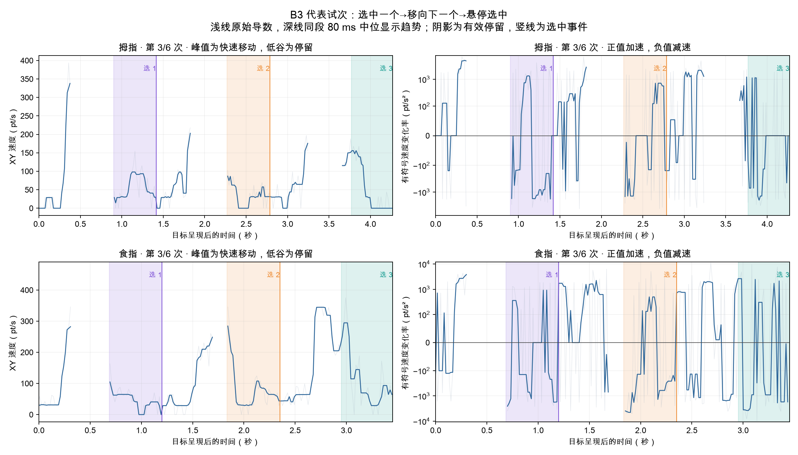

代表试次自动选为每姿势完成时长最接近中位数的一次。完整六次对齐如下：

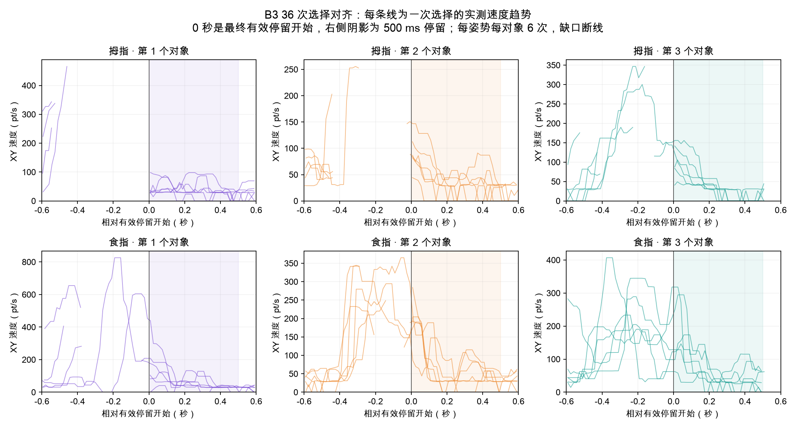

### 同几何单目标示例

下面保留相同距离、尺寸和方向的两姿势示例。A2 只展示接触拖动，B2 只展示悬停指向与有效停留；曲线结束处不补造零速度。图用于逐次观察起步、快速移动与制动，不把单个示例当成全部试次的平均曲线。

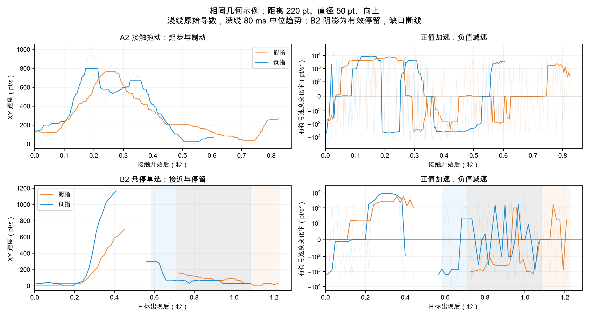

### 所有主动任务的阶段比较

| 任务／姿势 | 有效停留窗 | 有完整连续接近窗 | 停留更慢次数 | 接近／停留速度中位 pt/s |
| --- | --- | --- | --- | --- |
| B1 / 拇指 | 6 | 4 | 4 | 417.0 / 54.4 |
| B1 / 食指 | 6 | 3 | 3 | 181.2 / 43.9 |
| B2 / 拇指 | 6 | 4 | 4 | 422.9 / 37.3 |
| B2 / 食指 | 6 | 4 | 4 | 301.8 / 49.4 |
| B3 / 拇指 | 18 | 1 | 1 | 268.8 / 31.4 |
| B3 / 食指 | 18 | 11 | 11 | 218.1 / 58.1 |

接近取最终有效停留前 300 ms，需同段覆盖至少 200 ms；停留取前 500 ms，需覆盖至少 450 ms。可以检查“先较快移动→进入目标后减速→持续局部驻留”，但追踪缺口会让接近阶段不可观测。A 点击／拖动也有制动，因此需再加对象约束、是否接触和后续转移结构。缺口不当作停顿，原始导数抖动不当作动作纠正。

B1 菜单打开至点击的时间中位约 1.64 秒，形成第二个操作阶段；B3 共 36 次离散选择，每次任务三次驻留、两次对象转移。各轮 B3 全部按 t0→t1→t2 选择，当前尚未观察自由选择顺序。[查看加减速与多选细图](#section-6)。

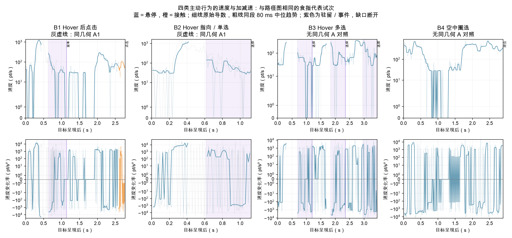

曲线仅展示代表试次，不是总体平均或显著性检验。正速度变化率为加速、负值为减速；转弯可以有较大二维加速度但不改变速度大小。B4 主要是连续空中移动与闭合，而不是多次低速驻留。原始位置噪声与回调时间抖动会放大导数，不能把每个正负尖峰解释成一次有意识的加速或纠正。

### 原始二维导数与姿势分布

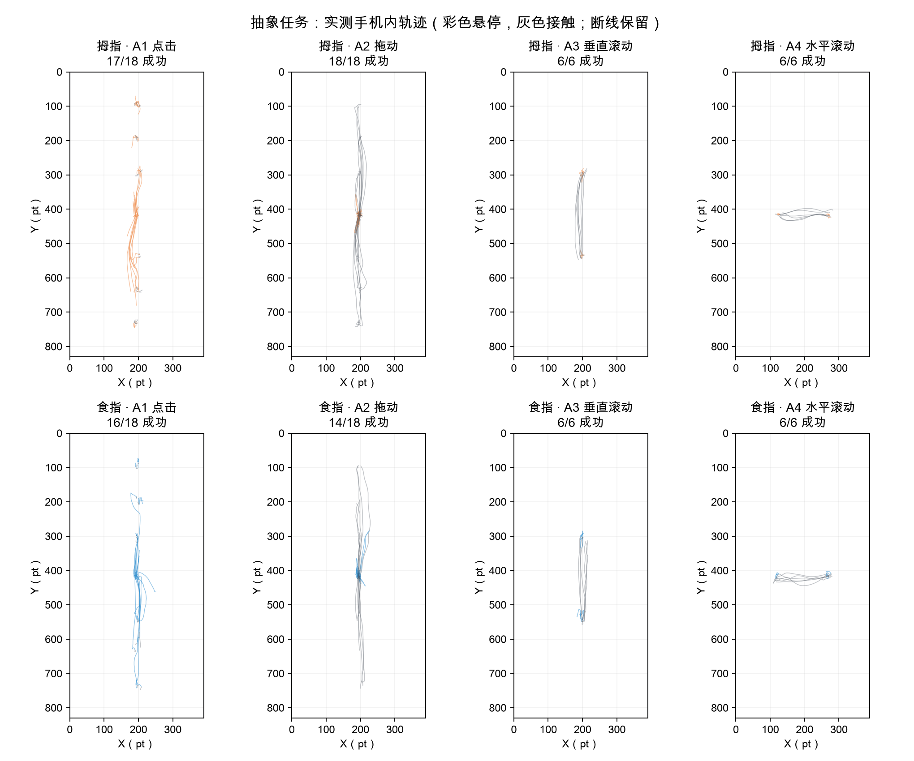

图中彩色为悬停、灰色为接触，全部实测点保留，手机外点、结束回调和缺口处断线。线多／路径长可能包含重定位与等待，不直接代表操作效率。

| 任务／输入 | 拇指速度中位 pt/s | 拇指加速度 P95 pt/s² | 食指速度中位 pt/s | 食指加速度 P95 pt/s² |
| --- | --- | --- | --- | --- |
| A2 / TOUCH | 182.0 | 17095 | 187.8 | 17515 |
| A3 / TOUCH | 540.4 | 22628 | 251.8 | 20468 |
| A4 / TOUCH | 292.1 | 18168 | 164.8 | 16365 |
| B2 / HOVER | 67.0 | 8300 | 77.3 | 10661 |
| B3 / HOVER | 31.2 | 4275 | 63.5 | 8349 |
| B4 / HOVER | 305.7 | 10457 | 288.3 | 22291 |

每试次先做时间加权分布，再取成功试次中位数；极短支持边不进入主要导数汇总。加速度更易受位置量化和采样时间影响，P95 仅用于观察急停／转向程度。上述任务几何及操作节奏不同，不宜合并成一个“姿势加速度”。

成功拖动最长连续接触段的路径／端点直线距离，中位数为拇指 1.10、食指 1.05（1 表示直线）。这反映食指成功段略直；目前只有双方成功的 14 个几何可配对，不能忽略失败或用单个段代表整次过程。垂直滚动两姿势约 1.04，水平滚动为 1.07/1.11，食指的速度更慢也没有普遍消除弯曲。

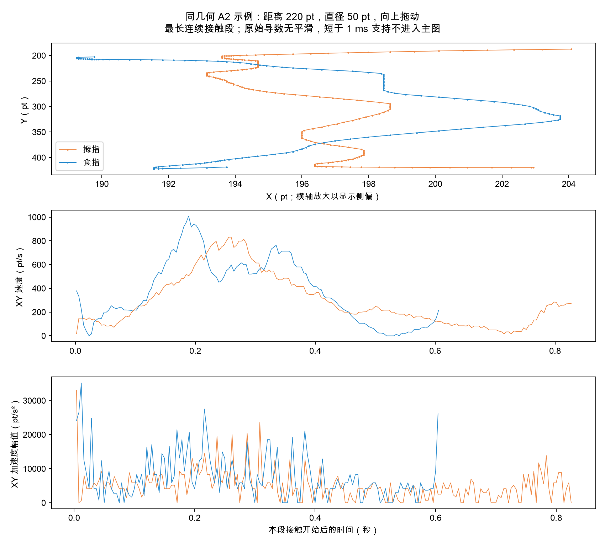

该图为同几何成功拖动示例，最长连续接触段；查看接触路径的横向摆动，以及速度的起步、峰值、减速。原始导数没有平滑，不跨断线连接。它是示例，不代表全部试次。

## 7. Intentional hover：静态线索与两种检验

| 达标窗口来自 | 500 ms 窗数 | 速度中位 pt/s | 位置 RMS 中位 pt |
| --- | --- | --- | --- |
| A5 长文阅读 | 26 | 42.9 | 6.0 |
| A6 图文浏览 | 24 | 43.8 | 7.4 |
| A7 短视频浏览 | 68 | 157.7 | 23.7 |
| B1 Hover 后点击 | 12 | 46.1 | 5.7 |
| B2 Hover 指向／单选 | 12 | 41.0 | 5.9 |
| B3 Hover 多选 | 36 | 35.2 | 5.2 |

这里比较同样达标 500 ms 的对象窗，排除了“是否达标”这个任务规则捷径。新闻候选 RMS 约 6 pt，B1/B2/B3 约 5–6 pt；单靠位置稳定无法明显区分。短视频自然候选约 24 pt，与主动 Hover 的距离更大，图文居中。主动停留的速度也并不总比阅读慢。

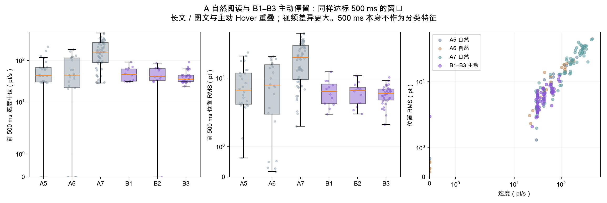

### 较早的C3跨姿势探索

**任务指令可以标出主动 Hover；仅凭本轮轨迹还不能可靠确认心理意图。** 以下比较同一 C3 阅读场景中同样达到 500 ms 的主动选择和自然候选。自然候选的“无意图”只是实验指令代理标签。

| 场景 | 指令标签 | 窗口数／试次数 | XY 速度中位 pt/s | 位置 RMS 中位 pt |
| --- | --- | --- | --- | --- |
| news | 自然 | 12 / 6 | 36.8 | 7.3 |
| news | 主动 | 8 / 8 | 41.8 | 4.9 |
| notes | 自然 | 5 / 3 | 57.2 | 7.6 |
| notes | 主动 | 9 / 9 | 34.8 | 4.5 |
| video | 自然 | 52 / 11 | 81.8 | 15.5 |
| video | 主动 | 10 / 10 | 30.2 | 4.1 |

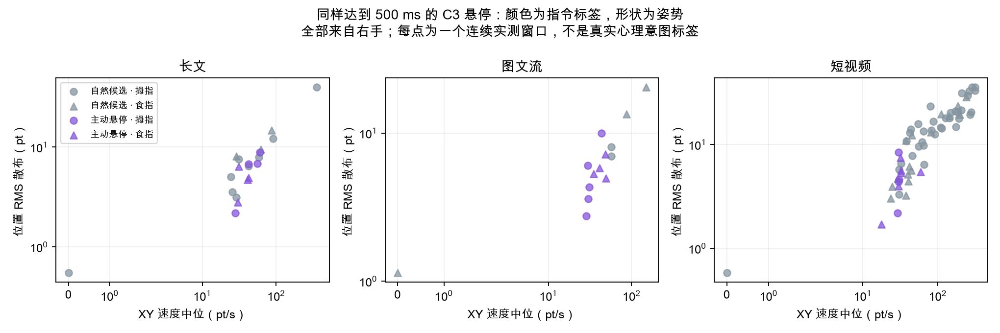

只取每次对象停留的前 500 ms，不使用确认后的轨迹。要求同一连续段至少 450 ms 覆盖和 12 个点；保留窗口起止及采样序号。不跨缺口，不插值，不把 Z 换算毫米。

### 跨姿势探索检验

使用速度中位数和位置 RMS 两个特征，在整轮上训练，再测试另一整轮。训练时平衡场景和类别权重，固定 0.5 阈值，不用任务名、条件或事件类别预测。AUC 衡量排序区分度（0.5 接近随机、1 为完全分开）；平衡准确率给两个类别相同权重。

| 训练→测试 | 测试主动／自然 | 主动识别 | 自然误报为主动 | 平衡准确率 | AUC |
| --- | --- | --- | --- | --- | --- |
| 拇指→食指 | 14 / 22 | 12/14 | 9/22 | 72.4% | 0.72 |
| 食指→拇指 | 13 / 47 | 10/13 | 11/47 | 76.8% | 0.85 |

**位置集中程度比速度提供更一致的线索。** 三场景主动窗口的位置散布中位约 4–5 pt，自然候选约 7–15 pt；但长文主动速度约 42 pt/s，自然约 37 pt/s，速度方向并不一致。两次跨轮测试分别把 9/22（40.9%）和 11/47（23.4%）的自然候选误报为主动，当前误报水平不足以支持可靠自动弹菜单。RMS 表示窗口内相对自身中心的位置散布，包含实际移动，不等于手部抖动幅度。

这是同一参与者的跨姿势探索，不是独立用户验证。主动条件只比较成功达标窗；未完成纯 Hover 的尝试不能补造正例。不同内容对象大小、候选机会及先后练习仍会影响结果。各场景检验见 [intent_exploration.json](../data-availability.html#local-files)，逐窗口证据见 [intent_episodes.csv](../data-availability.html#local-files)。

**500 ms 只定义规则触发，不能直接表示 intentional hover。** 自然阅读中存在同样长且稳定的停留；长停留的后续时长不能用于 500 ms 时刻的在线判断。B4 则是移动型主动 Hover：本轮共 7 个有效闭合圈，可以识别圈选动作，但不等同于任意悬停意图识别。

下一轮应在同一对象、同一视觉反馈下交替采集主动／自然停留，加入随机顺序和练习，并在独立参与者上验证。当前结果用于选择候选特征和定位规则误触风险。

**上述跨姿势模型使用一轮C3拟合、另一轮C3检查；下节A/B模型只用A/B拟合、C3检查。训练来源不同，准确率不能混用，也都缺独立参与者验证。**

## 8. C1–C3：混淆验证的实际覆盖与结果

| 混淆任务 | 主要验证什么 | 本轮数据是否够用 |
| --- | --- | --- |
| C1 同目标点击 vs Hover | A1/B2 的接近、局部停留及落笔边界 | TAP 12/12；HOVER 0/12，全部触屏。缺完整 500 ms 正例，不能验证成功纯 Hover 的分离性能 |
| C2 同条带滚动 vs Hover | A3/A4 定向接触移动 vs 悬停选择标记 | SCROLL 4/12；HOVER 4/12。滚动其余 8 次提前触屏，目标未显示；成功 HOVER 初始已在标记处，不适合验证远目标接近制动 |
| C3 同阅读内容自然 vs Hover | A5–A7 自然停留 vs 主动对象停留 | NATURAL 36/36；HOVER 27/36。可作成功窗口检验：69 自然候选 vs 27 主动窗；9 个未成功主动试次另保留 |

**正确流程是 A/B 发现候选特征→冻结特征／阈值→C 检验混淆。** 不能继续在 C 上挑特征、调阈值后把相同 C 当独立验证。先前我们已用 C3 做探索，因此下面叫“回顾性留组检验”。本次拟合只用 A/B，C 未参与参数拟合，但它不是此前完全未查看的新测试集。

C1–C3 没有 B3/B4 的同布局自然多目标或非圈选条件，也没有 B1 菜单两阶段混淆对照；它们主要验证静态 Hover 和接触／阅读边界，不能覆盖全部四类主动行为。

### 冻结A/B后检验C3

训练：A5–A7 的 118 个自然候选窗与 B1–B3 的 60 个主动窗；两个 XY 特征为速度中位数与位置 RMS。类别权重相同，每类内按试次均衡，避免长阅读或 B3 的多个对象支配拟合。只在训练集标准化，固定正则 0.1、阈值 0.5；不用事件类别、任务 ID、Z 或选择后的样本作预测特征。

| C3 检验 | 结果 |
| --- | --- |
| 主动正确识别 | 23/27 |
| 自然候选误报为主动 | 20/69（29.0%） |
| 平衡准确率 | 78.1% |
| AUC | 0.82 |

| 阅读场景 | 主动识别 | 自然误报 | 平衡准确率 | AUC |
| --- | --- | --- | --- | --- |
| news | 7/8 | 5/12 | 72.9% | 0.69 |
| notes | 8/9 | 2/5 | 74.4% | 0.78 |
| video | 8/10 | 13/52 | 77.5% | 0.87 |

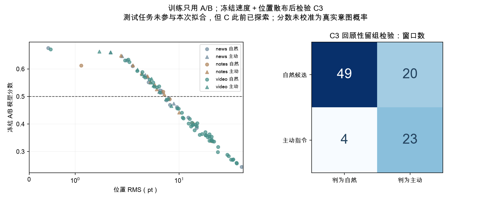

C2 四个完整主动窗被同一模型识别 4/4；没有成熟的自然候选负例，不能报告其完整二分类准确率。C1 没有完整主动达标窗，不补造正例。接触发生后的“有／无接触”可以识别已完成动作，但不能作为接触前的意图预测证据。

## 9. Home position：能检测到什么、多久可用

**能够估计手机内反复出现的低运动热点，尚不能把热点直接认定为自然休息位置。** 只用 A5–A7 自然基线学习，每姿势／场景分别估计；固定实验起点不进入学习。两轮均右手，拇指先、食指后。

### 1. 这次实际估计到什么

| 姿势／场景 | 前60s XY中心（pt） | 前主簇窗数 | 后主簇窗数 | 前后偏差pt | 初步候选 | 在线暂稳 | 回顾性稳定时间 | 状态 |
| --- | --- | --- | --- | --- | --- | --- | --- | --- |
| 拇指／新闻长文 | (305, 471) | 17 | 12 | 13.2 | 45s | 未暂稳 | 60s | 复现热点 |
| 拇指／图文信息流 | (281, 503) | 13 | 11 | 165.2 | 30s | 45s | 未复现 | 未确认 |
| 拇指／短视频流 | (267, 592) | 50 | 8 | 46.0 | 5s | 10s | 5s | 复现热点 |
| 食指／新闻长文 | (284, 367) | 12 | 16 | 174.0 | 20s | 30s | 未复现 | 未确认 |
| 食指／图文信息流 | (232, 493) | 8 | 55 | 37.1 | 60s | 未暂稳 | 60s | 复现热点 |
| 食指／短视频流 | (239, 550) | 8 | 4 | 39.2 | 30s | 60s | 未复现 | 未确认 |

坐标为手机局部坐标，左上角(0,0)，右下角(390,830)。圆半径固定50pt，主簇至少6个非重叠500ms完整窗；这些是统计中心，不伪装成实测坐标。前后主簇各≥6窗且中心差≤50pt才记“复现热点”。Z保留原API值，不参与主要位置判断，不换算毫米。

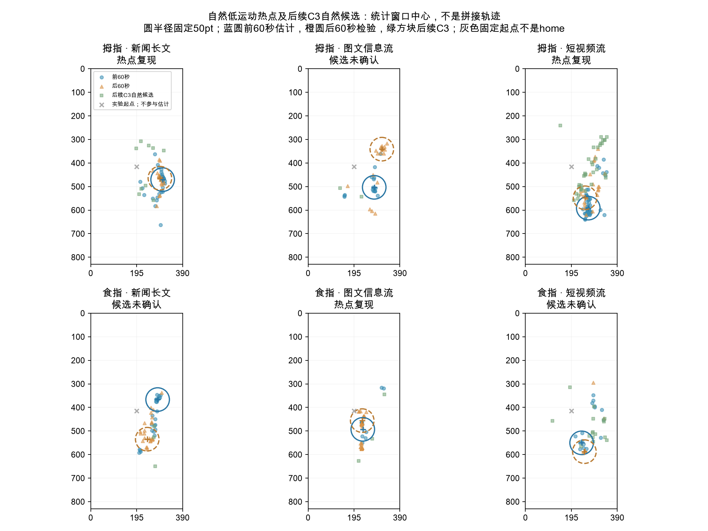

### 2. 在同一场景下需要多久

初步候选只表示至少积累约3秒有效低运动悬停，墙钟时间取决于真实感应覆盖。在线暂稳要求至少两个有新增窗口的检查点中心差≤20pt；它可能随后漂移。回顾性稳定时间另外要求此后各检查点始终接近60秒中心，并通过后60秒复现检查，不能把未来确认当成实时已知事实。取样检查点为2/5/10/15/20/30/45/60秒，时间是该网格上的观测上界。

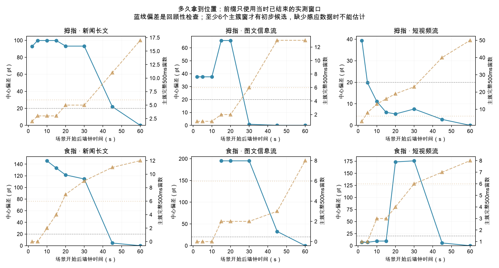

若笔尖长时间离开感应范围，系统拿不到其实际位置；缺口不当作休息。低运动也可能是正在阅读、对准或看菜单，因此3秒累计数据不等于3秒就确认心理home。实际在线使用需显示/维护置信度，未确认时不进行位置拒绝。

### 3. 同一姿势能否全场景共用一个home

| 姿势 | 场景对 | 前60秒中心距离pt |
| --- | --- | --- |
| 拇指 | 新闻长文／图文信息流 | 40.9 |
| 拇指 | 新闻长文／短视频流 | 127.0 |
| 拇指 | 图文信息流／短视频流 | 89.4 |
| 食指 | 新闻长文／图文信息流 | 136.6 |
| 食指 | 新闻长文／短视频流 | 189.2 |
| 食指 | 图文信息流／短视频流 | 57.6 |

页面布局和手部操作位置会影响热点，应先按姿势和场景建立位置参考；手机屏幕位置与阅读内容对象是不同参照，页面滚动不能把同屏位置误当成同一内容对象。握姿变化应重新学习。

### 4. 用home抑制规则可能触发，实际收益如何

| 同段自然阅读：前60s估计→后60s检查 | 自然候选窗 | 位置规则抑制窗 | 后续C3应用时模型年龄中位min |
| --- | --- | --- | --- |
| 拇指／新闻长文 | 3 | 2 | 10.8 |
| 拇指／图文信息流 | 7 | 0 | 9.6 |
| 拇指／短视频流 | 15 | 2 | 5.8 |
| 食指／新闻长文 | 7 | 0 | 9.4 |
| 食指／图文信息流 | 5 | 0 | 10.4 |
| 食指／短视频流 | 18 | 0 | 7.3 |

同段检查只用训练主簇足够的模型，不用后半段结果选择模型；只有自然条件，所以候选减少量不等于意图识别性能。后续C3虽然场景名称相同，已隔多个操作阶段，内容及笔尖常驻位置可能改变；旧参考点的迁移效果需单独测量。

冻结A前60秒中心，以A后60秒确认是否复现，不用B/C调整中心或半径。仅当同姿势／同场景模型复现、当前500ms窗≥80%实测时间在home圆内、速度中位≤100pt/s且RMS≤15pt时模拟降低触发；其余窗口保留。此处为了测风险模拟完全抑制，产品只应把home作为负向先验并允许明确主动操作。

| C3成功/自然候选窗口 | 主动识别 | 自然候选误报 | 平衡准确率 |
| --- | --- | --- | --- |
| 原A/B速度-RMS模型 | 23/27 | 20/69 | 78.1% |
| 只用home过滤，其余均视为候选 | 26/27 | 69/69 | 48.1% |
| 速度-RMS＋50pt home | 22/27 | 20/69 | 76.2% |

50pt规则在96个C3窗口中有 60 个具备复现模型，抑制 0/69 个自然候选，同时误排 1/27 个成功主动窗。模型缺失窗口不抑制；这些不是实际误触/心理意图标签。

**本轮固定home没有改善C3区分：自然误报没有减少，还误排了一个主动窗。** 即使把半径扩到80pt，原模型自然误报仅由20降至18，同时主动识别23降至22，平衡准确率77.7%仍低于原78.1%。不能据此部署固定位置拒绝规则。

| 阅读场景 | 原主动识别／自然误报 | 加home后主动识别／自然误报 |
| --- | --- | --- |
| 新闻长文 | 7/8 · 5/12 | 7/8 · 5/12 |
| 图文信息流 | 8/9 · 2/5 | 8/9 · 2/5 |
| 短视频流 | 8/10 · 13/52 | 7/10 · 13/52 |

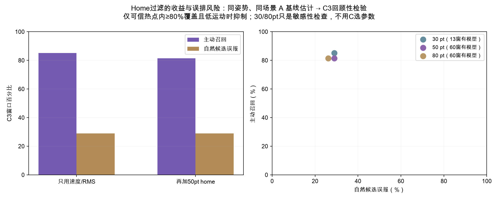

### 5. 可以用到哪些行为，哪些不能硬过滤

| 主动任务／姿势 | 完整500ms窗 | 跨阅读home模型可用窗 | 模拟误排窗 |
| --- | --- | --- | --- |
| B1／拇指 | 6 | 6 | 0 |
| B1／食指 | 6 | 0 | 0 |
| B2／拇指 | 6 | 6 | 0 |
| B2／食指 | 6 | 0 | 0 |
| B3／拇指 | 18 | 18 | 0 |
| B3／食指 | 18 | 0 | 0 |

B1–B3 的表只检查阅读home向抽象任务迁移的误排，不能冒充同场景验证。若指定目标就在home附近，用户仍能有主动意图；B1菜单后移动/点击、B3多目标转移与B4闭合路径必须保留。B4不参与静态位置抑制，不裁剪home内轨迹；强制起点也不能被当成无意图区。

## 10. 可保留的行为特征与下一轮验证

| 特征家族 | 本轮判断 | 用途 |
| --- | --- | --- |
| 速度／加减速幅值 | A/B 都有，单独区分弱；易受采样抖动影响 | 组合中的运动阶段信号，保留实际时间差 |
| 小区域驻留与目标命中 | 主动与新闻／图文有明显重叠，视频差异更大 | 候选筛选，必须结合对象边界和感应覆盖 |
| 接近制动＋局部驻留＋无接触 | 比单一停留更有解释力，但连续接近覆盖有限 | B2 指向／静态选择的候选组合，待同对象验证 |
| 悬停→菜单→再定位→点击 | 完整操作结构清楚，含界面状态的任务证据 | B1 动作识别；不能当菜单出现前的独立意图分类器 |
| 多个对象离散驻留及转移 | B3 有清楚重复节奏，当前顺序与对象由任务固定 | 多选手势家族识别，需相同布局自然对照 |
| 无接触的大面积闭合路径 | B4 是当前最强路径结构候选，独立扫描结果见上表 | 圈选手势识别；与静态意图分开评估 |

**下一轮最该补的是困难负例和专项混淆对照。** C1/C2 先练习并重新采集完整正例；为 B3 增加同布局自然经过／多点点击，为 B4 增加同布局不闭合经过／空中划动；C3 在相同对象大小、反馈和内容阶段采集主动／自然条件。固定特征后交给未参加训练的新参与者，不只复测同一人。

[逐试次特征](../data-availability.html#local-files) · [窗口及 C3 分数](../data-availability.html#local-files) · [结果与模型参数](../data-availability.html#local-files) · [原总报告](#section-1) · [加减速细图](#section-6) · [3D 回放](../replay/replay-v2.html)

数据来源：HoverIntent_2026-09-15 2.csv；SHA256 1c2eff5549ea4bafb76b2d7e683e31ef5db07187161ffe2bda50f25859940b89。原 CSV 未改动，保留全部失败、原菜单指令和用户覆核。自然候选的标签来自任务指令，不是逐段确认的心理意图；单参与者两姿势与先后练习效应仍限制泛化。

### 建议的分析边界

- 在线候选只用判定时已经收到的数据，接触或菜单出现后的动作用于完成分析，不能作为出现前意图预测的输入。
- 静态指向/驻留与移动型圈选分开建模；B3 的对象转移序列需要专项困难负例，不能被C3阅读窗口的准确率代替。
- 自然候选标签来自指令，若要测真实误触，需要独立人工意图标注或用户确认；本轮没有真实误触地面真值。
- 新一轮先练习 C 的零触屏条件，再固定特征与阈值，并用新参与者检验。失败重试保留全量尝试，用首次成功率和每题重试数避免“收齐有效数据=全部容易成功”的解释。

## 11. 本次采集App修订：V2.2（与实测结果分开）

A/C 用于有效baseline与混淆验证，B用于成功率和行为轨迹，因此采用不同推进策略。

| 修订 | 新行为 |
| --- | --- |
| A1–A7 / C1–C3 | 失败保留记录，1.2秒后重试同一计划题；不换条件/几何，不增加原定进度，成功后进入下一题 |
| 研究者重启A/C | “重新开始本题”保留当前尝试再重试；整组仍可明确结束并报告未完成配额 |
| B1–B4 | 默认各12次（原各6次），B配平套数可独立配置；成功/失败均推进，所有尝试保留 |
| 默认总量 | 156次短任务＋3段120秒阅读，姿势/任务仍任选 |
| C1 | 24/36/48pt小圆，距离220pt，两方向两条件配平 |
| C2 | 36×36pt标记，80×80pt终点窗口；中心起点与标记分离120pt，滚动需从标记接触开始 |
| C3 | 48×48pt新闻路线缩略配图 / 图文卡片收藏星标 / 视频收藏星标；只框该具体对象 |
| C3自然候选 | 同一指定小对象静默候选，反馈保持自然；不再把整个视频或卡片作为目标 |
| 旧数据/旧会话 | 不改写；无revision的恢复配置继续按V2.1执行，新会话使用V2.2 |

原CSV仍是旧目标与旧推进规则。新版缩小对象会改变候选机会，不能把新旧每分钟候选率不分协议直接比较。B1原菜单覆核只是本轮分析注释，新App仍要求完成屏幕上明确提示的菜单项。

### 本次验证状态

| 检查 | 实际状态 |
| --- | --- |
| status | PASS_AUTOMATED_AND_INSTALLED |
| coreTests | PASS · 50/50 |
| simulatorUITests | PASS · 8/8 |
| analysisRegression | PASS · 13/13 |
| unsignedIOSBuild | PASS |
| signedIOSBuild | PASS |
| originalCSVAndPandas | PASS · 266246行/56列 |
| simulatedCSVAndMetadata | PASS · 独立SIMULATED文件，4条重试关联 |
| deviceInstall | PASS · iPad14,5 · 2.2/build3 |
| foregroundLaunch | PASS · devicectl确认启动 |
| originalDataPreservation | PASS · 安装前后SHA256一致 |
| physicalPencilValidation | NOT_RUN · 新小目标/重试需参与者试做 |
| new15MinuteHardwareRun | NOT_RUN |
| newAirDropAcceptance | NOT_RUN |

## 12. 单位、数据质量、可追溯方法与交付

**pt 是界面坐标单位（point，点）。** 手机仿真宽390pt、高830pt；“RMS 4–5pt”表示500ms窗口内笔尖相对该窗口自身中心的二维散布，约为手机宽度的1%–1.3%，不是离目标中心4–5pt，也不是毫米或纯生理抖动。XY速度用pt/s，有符号速度变化率用pt/s²。Z保留API原始值，3D回放的高度只是显示比例，不能合成物理三维加速度。

| 姿势 | 排除坐标数量 | <1 ms 连续边 | 悬停间隔中位 ms | 接触间隔中位 ms |
| --- | --- | --- | --- | --- |
| 拇指 | {"outside": 348, "outsideTrial": 87} | 0 | 16.67 | 4.00 |
| 食指 | {"outside": 351, "outsideTrial": 79} | 2 | 16.66 | 4.00 |

回调间隔并非硬件采样率证明。指标限制在 TRIAL_START 至 TRIAL_END，outsideTrial 是间隔中仍标为前一试次的采样，单独计数且原 CSV 保留。全部合法边在 [motion_metrics.csv](../data-availability.html#local-files) 导出，主要汇总门槛及支持序号可追溯。跨范围或缺口不计算导数，原始 Z 不换算毫米。

两轮 C1 的 HOVER 条件均 0/6 成功，错误是 Pencil `UNEXPECTED_TOUCH`；这组当前反映参与者在纯悬停任务中触屏，无法拿失败时间评价悬停性能。其余错误按任务保存于 [task_summary.csv](../data-availability.html#local-files)。B1 两轮共 12 次均选 B，六次要求 A 的记录原判失败。按用户看题说明，分析按动作完成覆核，原始失败标记见 rawSuccess/rawError，不改写 CSV。

仅有一名参与者每姿势一轮，且拇指先、食指后；该数据支持行为描述和原型诊断，不能给出总体姿势优劣或显著性结论。两轮均为用户确认的右手，本轮比较拇指／食指与顺序影响。

### 数据完整性与覆盖

原CSV266,246行、56列：165,474条SAMPLE与100,772条EVENT；无残缺CSV行。本文两轮接收150,905个样本，过滤后回放保留150,040个手机内点；排除699个手机外点和166个试次边界外点。两轮未发现手指/模拟/污染输入；全文件旧协议中有手指样本，未混入本次分析。

146,265条合法连续运动边保留；其中2条短于1ms的边从主要导数统计排除，原坐标不删除。超100ms、输入来源切换、结束/重新开始、范围外和污染处断线；不平滑坐标、不补点。曲线仅在同段显示80ms中值趋势。前接近300ms需至少200ms覆盖，驻留500ms需450ms和12个点。接触前600ms覆盖按实际连续有效边计算，不能用窗口最早/最晚时间冒充完整覆盖，逐试次指标可查。

两轮各持续超过15分钟是观察到的会话时长；本报告没有完成新版15分钟硬件接收/落盘专项比对。悬停回调间隔约16.67ms、接触约4ms，不能据此宣称硬件频率或全时段无采样缺口。完整SCROLL/VIDEO事件用于统计，回放场景状态预览最高20Hz，不能从预览数量重算滚动次数。

### 单一入口与详细证据

[手机3D回放](../replay/replay-v2.html) · [逐试次数据](../data-availability.html#local-files) · [原始运动边](../data-availability.html#local-files) · [有符号阶段导数](../data-availability.html#local-files) · [多选逐对象指标](../data-availability.html#local-files)

[静态窗口和C检验分数](../data-availability.html#local-files) · [目标内停留指标](../data-availability.html#local-files) · [阅读场景指标](../data-availability.html#local-files) · [home候选窗](../data-availability.html#local-files) · [home过滤逐窗](../data-availability.html#local-files) · [菜单覆核](../data-availability.html#local-files)

[原两轮比较报告](#section-1) · [加减速/多选细图](#section-6) · [A/B/C详细报告](#section-8) · [home详细报告](#section-9) · [来源与结果快照](study-report.json)

来源文件：HoverIntent_2026-09-15 2.csv；328,198,639字节。SHA256：`1c2eff5549ea4bafb76b2d7e683e31ef5db07187161ffe2bda50f25859940b89`。本报告生成前复核原文件哈希与各分析快照一致，未修改原CSV。复现命令：

```sh
python3 qa/build_study_report.py --source "data/HoverIntent_2026-09-15 2.csv" --output analysis/trajectory_2026-09-15/hands_run2
```

本报告汇编脚本仅依赖Python标准库。原分析脚本与测试保留在qa/；所有图和窗口证据保留，没有将算法闭合边或统计位置中心伪装成实测点。
